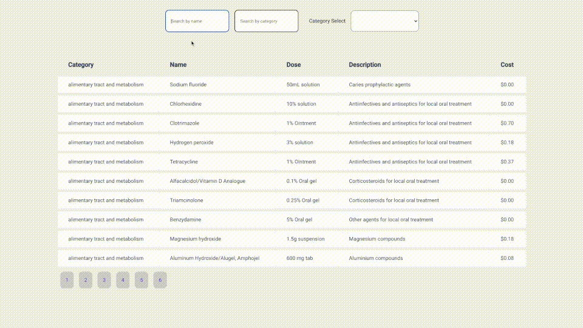
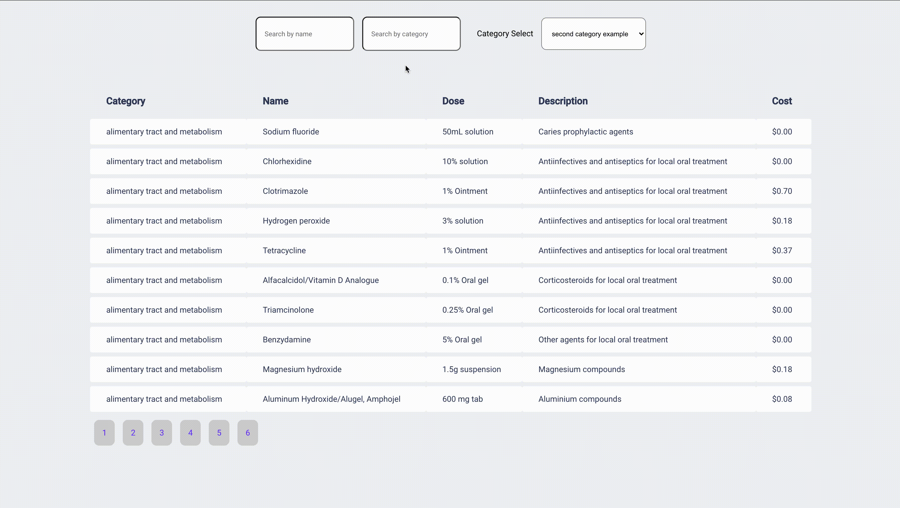
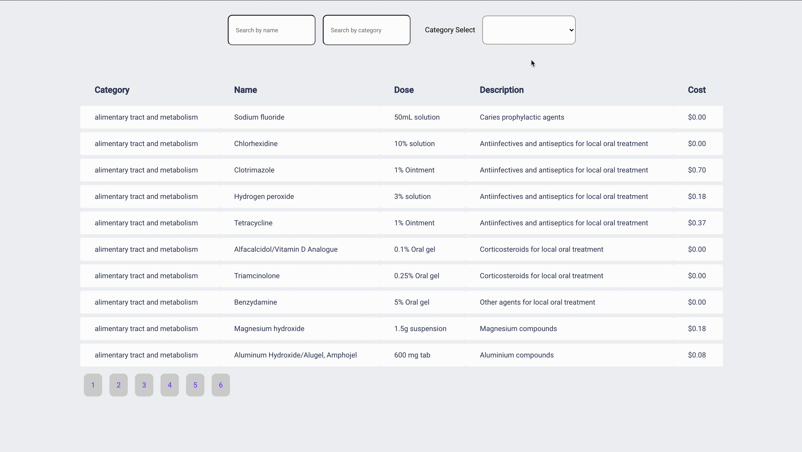

<h1 align="center"><strong>CYBERPATIENT FRONT-END</strong></h1>
<br/>

<h2>🏗 <strong>Build and Run Instructions</strong></h2>
<br>

<p>This is a [REACT.js](https://reactjs.org/) project bootstrapped with [`create-react-app`](https://github.com/facebook/create-react-app).
</p>

<p>Installation:</p>

```javascript
$ npm install
```

<p>or alternatively,</p>

```javascript
$ yarn install
```

<br>
<p>Running:</p>

Open one terminal and execute the following command:

```javascript
$ npx json-server --watch -p 3333 server.json
```

Open another temrinal to start the frontend:

```javascript
$ npm run start
```

<p>or alternatively,</p>

```javascript
$ yarn start
```

<hr>
<br>

<h2><strong>Moving Around </strong></h2>
<br>
<p>Selecting name:<p>



<br>
<br>
<p>Selecting category:<p>



<br>
<br>
<p>Category dropdown<p>




<br>
<br>
<p>Guilherme Eckert<p>